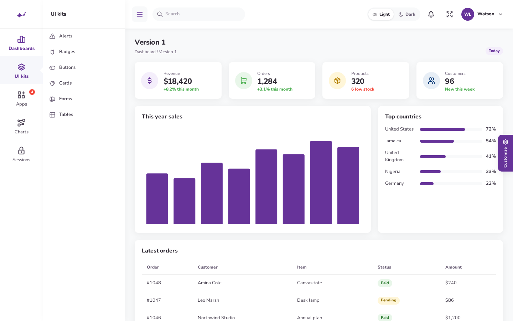
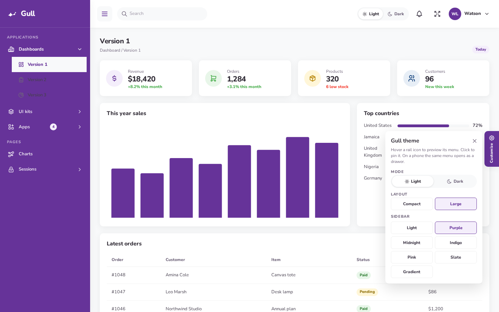
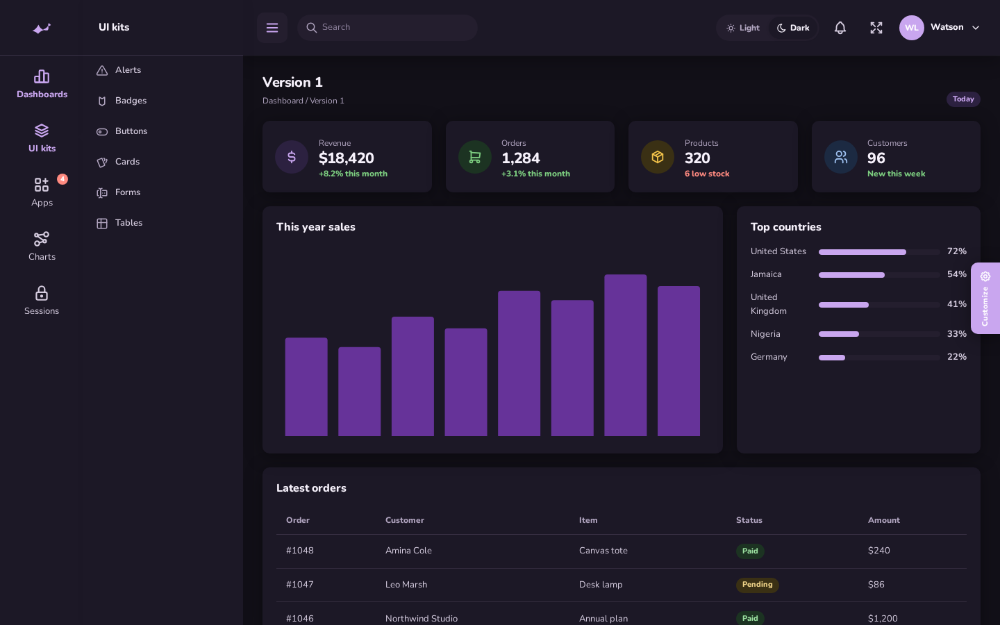
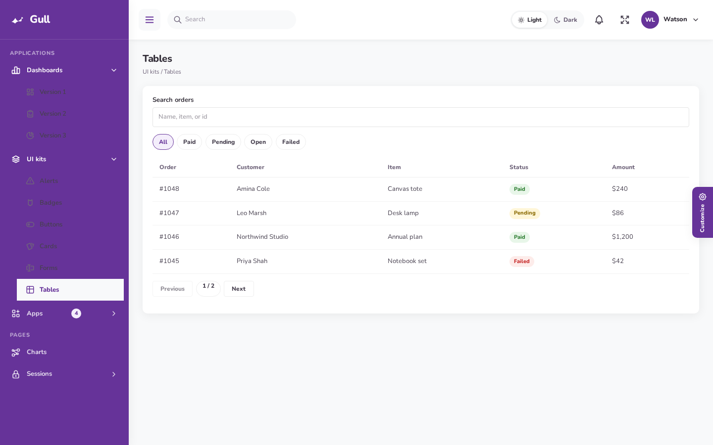
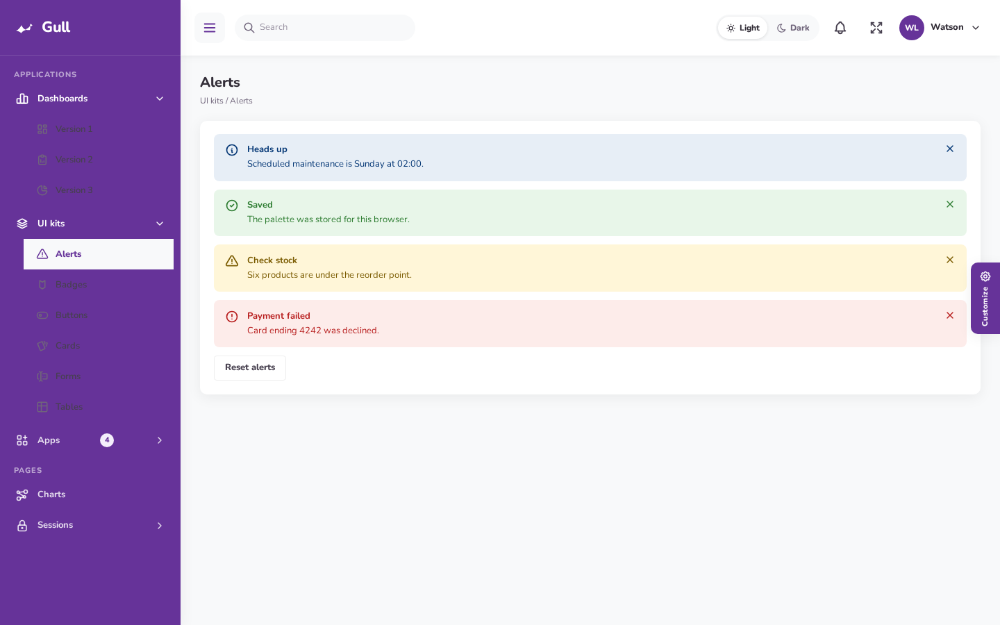

<p align="center">
  
</p>

# Fascia by Spiggle

A panel theme for Filament: Nunito, `#663399` primary, soft 10px cards, a compact icon rail with a flyout, and a large accordion sidebar.

Built for **Filament 4.x and 5.x** on **Laravel 11, 12, and 13** with PHP 8.2+.

[**View the theme page →**](https://skillbobby.github.io/spiggle/filament-fascia-theme/)

---

## Look and feel

| Layout | How the menu works |
|---|---|
| **Compact** (default) | A 120px rail. Each parent is a Tabler icon with a 13px label under it. Hover opens a 230px white flyout of that section. Click pins the flyout; click again closes it. A triangle marks the open section. |
| **Large** | A 260px sidebar. Section labels are uppercase. Items accordion in place, icon then label. |
| **Phone** | Both layouts become an off-canvas drawer with a dimmed backdrop. Targets are at least 44px. Compact keeps the icon rail and shows children beside it. The hamburger opens and closes it. Search collapses to an icon. |

The page background is `#f8f9fa`. Cards use a 10px radius and the shadow `0 4px 20px 1px rgba(0,0,0,.06)`. Body type is Nunito at 13px inside the panel. Primary actions and the active rail item are `#663399`.

<p align="center">
  
</p>

Sidebar skins match Fascia’s compact colors: light, purple, midnight, indigo, pink, slate, and a purple–indigo gradient. The flyout stays white.

<p align="center">
  
</p>

## Features

- **Compact rail and flyout.** 120px icon rail, 230px secondary panel, triangle pointer, hover to preview, click to pin.
- **Large sidebar.** 260px accordion with uppercase group labels.
- **Light and dark mode.** A Light / Dark switch in the top bar, on the sign-in screen, and in Customize. Stored in `localStorage` as `fascia-mode`.
- **Seven sidebar skins.** Stored as `fascia-skin`. Set `'customizer' => false` to hide the gear tab.
- **Tabler icons, fixed sizes.** 26px on the rail, 18px in the flyout, 20px in the large sidebar, 22px in the top bar. Same 24×24 outline grid, stroke 2.
- **Mobile drawer.** Off-canvas, dimmed backdrop, 44px targets.
- **Filament surfaces.** Tables, alerts, buttons, badges, cards, and forms keep native behavior and pick up the Fascia chrome.
- **Filament 4 and 5.** One plugin. Render hooks are resolved by name so a missing hook on one major version is skipped.

<p align="center">
  
</p>

<p align="center">
  
</p>

## Components

<p align="center">
  
</p>

- **Tables.** Card surface, status pills, and a rounded search field.
- **Alerts.** Info, success, warning, and danger on tinted surfaces.
- **Buttons and badges.** Primary `#663399`, plus secondary, success, danger, and ghost.
- **Forms.** 40px fields, two-column grids, and inline errors.

<p align="center">
  
</p>

## Requirements

| Package | Version |
|---|---|
| PHP | ^8.2 |
| Laravel | 11.x, 12.x, or 13.x |
| Filament | ^4.0 or ^5.0 |

## Installation

```bash
composer require spiggle/filament-fascia-theme
composer require secondnetwork/blade-tabler-icons
php artisan filament:assets
php artisan vendor:publish --tag=filament-fascia-theme-config
```

Fascia registers itself on every panel. Publish the config and set `auto_register` to `false` to opt a panel out, then add `FilamentFasciaThemePlugin::make()` yourself.

## Theme switcher

`spiggle/filament-theme-switcher` (Filament 5, PHP 8.3) attaches to every panel on its own. It does not scan Composer for arbitrary theme plugins. A theme is listed only if it calls `ThemeRegistry::registerTheme()`. Fascia does that when the switcher is installed, and only paints the rail, Nunito, and stylesheet while Fascia is the selected theme. Soffit uses the same contract. A theme that never registers will not appear.

## Menus

Filament only prints child links when the parent has **no URL** (or that branch is already active). Parents used as rail sections must not have a URL, or the flyout will be empty until you are already inside it.

Do **not** put an icon on the navigation group. Filament throws if a group and its items both have icons. Put Tabler icons on the parent item and on each child.

```php
use Filament\Navigation\NavigationGroup;
use Spiggle\FilamentFasciaTheme\Fascia;

$panel->navigationGroups([
    NavigationGroup::make('Applications')->collapsible(false)->items([
        Fascia::parent('Dashboards', 'tabler-chart-bar', [
            Fascia::link('Version 1', 'tabler-layout-dashboard', '/admin'),
            Fascia::link('Version 2', 'tabler-report-analytics', '/admin/sales'),
        ]),
        Fascia::parent('UI kits', 'tabler-stack-2', [
            Fascia::link('Alerts', 'tabler-alert-triangle', '/admin/alerts'),
            Fascia::link('Tables', 'tabler-table', '/admin/orders'),
        ]),
        Fascia::link('Charts', 'tabler-chart-dots-3', '/admin/charts'),
    ]),
]);
```

Groups should be `->collapsible(false)` so a section header cannot hide the rail.

The theme turns on `sidebarCollapsibleOnDesktop()` because that is when Filament renders icons on nested items. Its own hamburger keeps the Filament sidebar open and toggles the Fascia flyout (or slides the large sidebar away) instead.

## Customize

A gear tab on the right switches layout and sidebar skin. Choices are stored in `localStorage` (`fascia-layout`, `fascia-skin`, `fascia-mode`). Defaults live in `config/filament-fascia-theme.php`.

| Key | Values |
|---|---|
| `layout` | `compact` (default), `large`. Env: `FASCIA_LAYOUT` |
| `sidebar` | `light`, `purple`, `midnight`, `indigo`, `pink`, `slate`, `gradient`. Env: `FASCIA_SIDEBAR` |
| `customizer` | `true` to show the gear tab |

Icons are [Tabler outline](https://tabler.io/icons).

## Security

If you discover a security issue, email **skillbobby@outlook.com** instead of opening a public issue.

## License

Same packages as Soffit. Checkout links are Fascia’s own and are not live on this page until they are supplied.

| Plan | Price | Includes |
|---|---|---|
| **Single Site** | **$19** | 1 production panel · 1 year of updates and security fixes |
| **Unlimited Projects** | **$49** | Unlimited sites and client projects · 1 year of updates · priority support |

Purchase from the [theme page](https://skillbobby.github.io/spiggle/filament-fascia-theme/#pricing). Until those URLs are pasted into `FASCIA_CHECKOUT` on that page, the buy buttons go to [@iamspiggle](https://x.com/iamspiggle).
