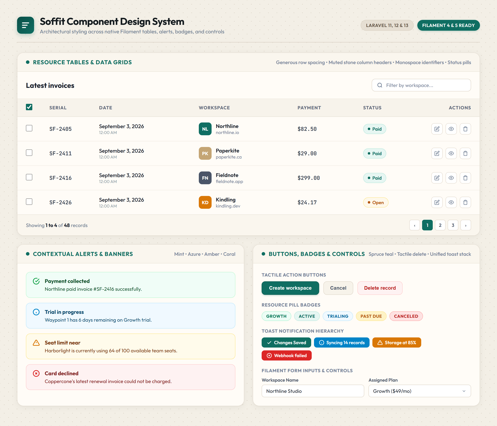

# Spiggle Soffit Theme for Filament

A soft, refined admin theme for Laravel Filament by Spiggle. Features a full-height white sidebar, rounded cards, quiet ambient shadows, Outfit typography, and calm teal & brass accents.

Built for **Filament 4.x and 5.x** on **Laravel 11, 12, and 13** with PHP 8.2+.

[**View Live Documentation & Theme Simulator →**](https://skillbobby.github.io/spiggle/filament-soffit-theme/)

---

## Highlights

- **Full-Height White Sidebar:** Clean vertical divider, custom tiered brand mark, and integrated documentation/help footer.
- **Warm Editorial Color Palette:** Soft canvas (`#f3efe6`), creamy ivory card surfaces (`#fffcf7`), architectural brass tones (`#c4a574`), and deep calm teal (`#0f6e62`).
- **Rounded Cards & Quiet Shadows:** Restyled stat widgets, resource tables, and form sections with generous border radii and subtle depth.
- **Built-in Dark Mode:** Automatic or switchable dark mode tuned with deep espresso slate (`#12100e`) and soft night surfaces.
- **Zero Vite/Tailwind Builds:** Pure CSS override injected via Filament panel hooks. Instant hot-swapping with no build step required.
- **Spiggle Theme Switcher Ready:** Integrates seamlessly with the Spiggle theme registry or operates standalone across all panels.

---

## Component Styling

Soffit styles every native Filament component with intentional architectural details:

<p align="center">
  
</p>

- **Resource Tables & Data Grids:** Generous row heights, muted stone column headers, rounded pill status badges (`Paid`, `Open`), customer avatars, and quiet action button icons.
- **Contextual Alerts & Banners:** Soft mint (success), azure (info), amber (warning), and coral (danger) alert cards with thin architectural borders and matching icons.
- **Buttons, Badges & Toasts:** Tactile primary buttons in deep spruce teal (`#0f6e62`), rounded danger and ghost actions, pastel status badges (`GROWTH`, `ACTIVE`, `TRIALING`), and unified toast notifications.

---

## Requirements

| Package | Version |
|---|---|
| PHP | ^8.2 (supports PHP 8.2, 8.3, 8.4, 8.5) |
| Laravel | 11.x, 12.x, or 13.x |
| Filament | ^4.0 or ^5.0 |

---

## Installation

Install the package via Composer:

```bash
composer require spiggle/filament-soffit-theme
```

The plugin automatically registers itself on every panel. To manually configure registration, publish the configuration file:

```bash
php artisan vendor:publish --tag=filament-soffit-theme-config
```

## Ledger tables

While Soffit is the active theme, every table keeps its search, shows filters above the records, applies those filters immediately, and uses Filament's native row selection. Declare a status column only on tables that have one. Tables that do not declare a status still get the look and selection, without a Set status action.

```php
use Spiggle\FilamentSoffitTheme\Tables\Status;

$table
    ->toolbarActions([
        // Your own bulk actions, such as delete, stay in the app.
    ])
    ->status(
        Status::make('status')->default('paid')->values([
            'paid' => Status::option('Paid', 'success'),
            'open' => Status::option('Open', 'warning'),
            'void' => Status::option('Void', 'gray'),
            'uncollectible' => Status::option('Uncollectible', 'danger'),
        ])
    );
```

`Status::option()` takes the label and an optional color: `success`, `warning`, `info`, `danger`, or `gray`. For a boolean column, call `->boolean()` and use `"1"` / `"0"` as the stored values:

```php
$table->status(
    Status::make('is_public')->label('Status')->boolean()->values([
        '1' => Status::option('Public', 'success'),
        '0' => Status::option('Private', 'gray'),
    ])
);
```

Call `->status()` after `->columns()` and after `->toolbarActions()`, so the inline control is appended and Set status joins the existing bulk menu.

Then register the plugin in your Filament Panel Provider (e.g., `AdminPanelProvider.php`):

```php
use Spiggle\FilamentSoffitTheme\FilamentSoffitThemePlugin;

public function panel(Panel $panel): Panel
{
    return $panel
        // ...
        ->plugin(FilamentSoffitThemePlugin::make());
}
```

---

## Licensing & Pricing

Soffit is released under a commercial license with two flexible options:

| Plan | Price | Details |
|---|---|---|
| **Single Site** | **$19** | 1 production site · 1 year of updates & security fixes |
| **Unlimited Projects** | **$49** | Unlimited sites & client projects · 1 year of updates |

Purchase licenses via [Lemon Squeezy](https://skillbobby.github.io/spiggle/filament-soffit-theme/#pricing).

---

## Security

If you discover any security-related issues, please email **skillbobby@outlook.com** instead of opening a public issue.

---

## License

Commercial © Spiggle. All rights reserved.
