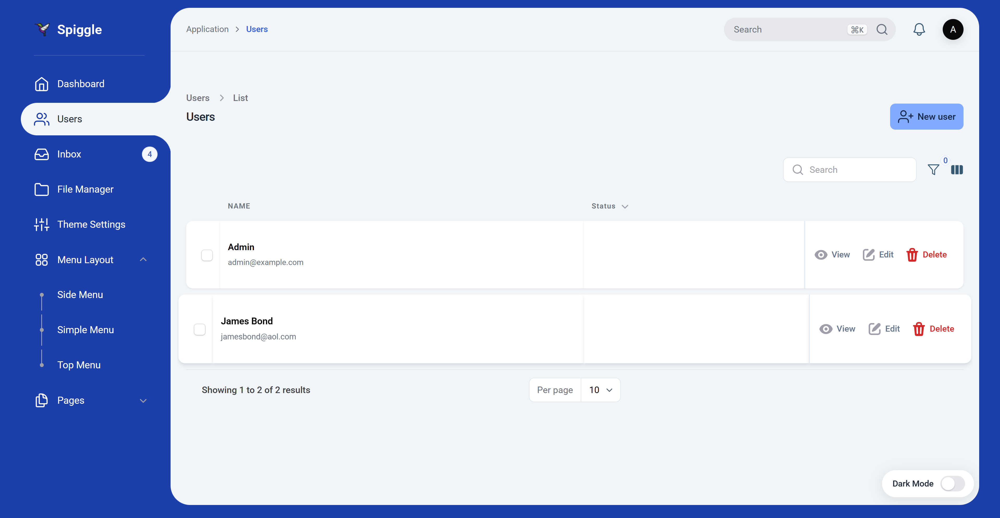
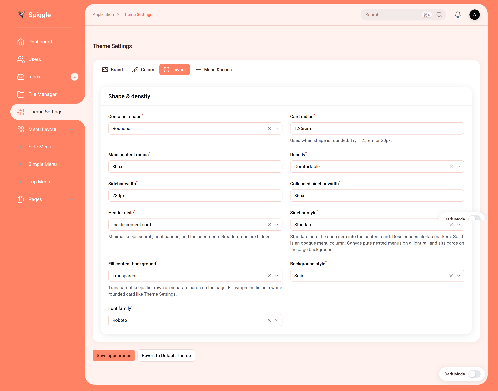
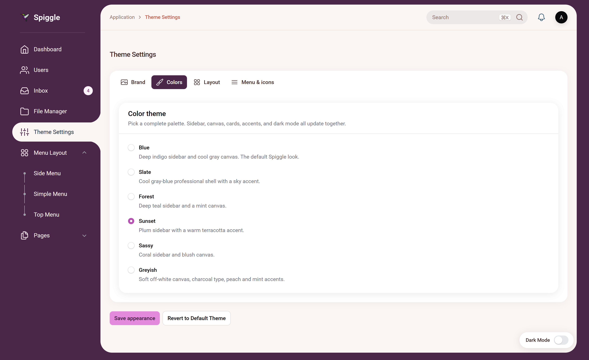
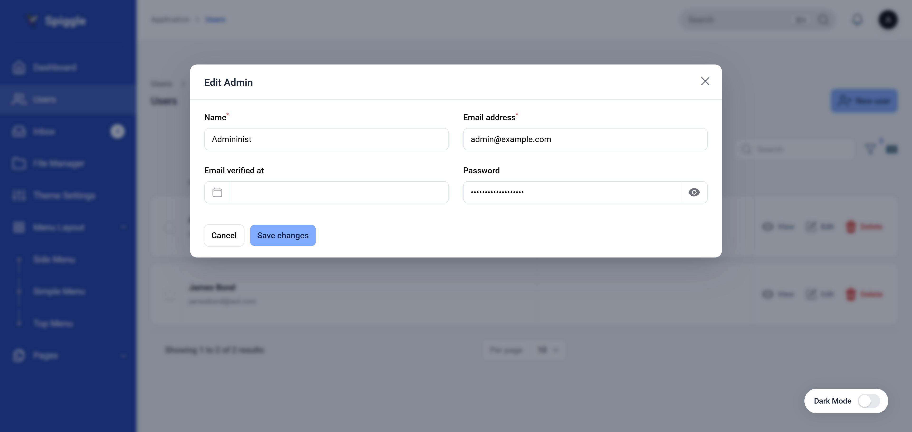
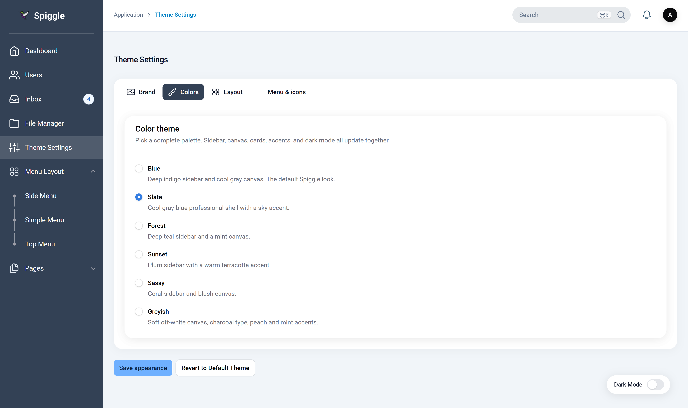
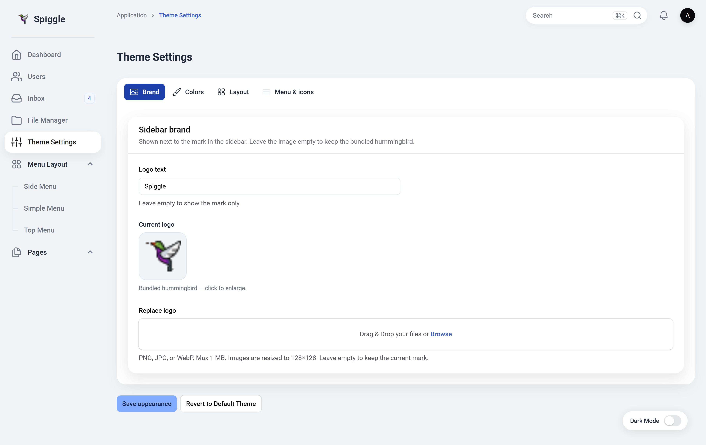
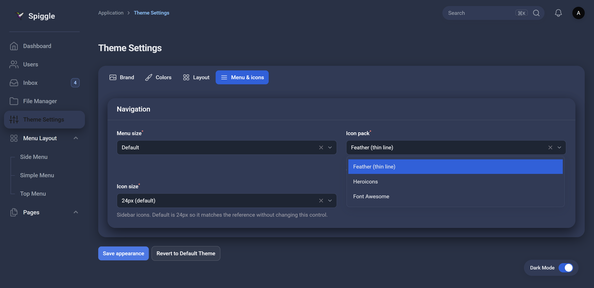

# Filament Spiggle Theme

A Filament PHP admin theme: deep blue sidebar, rounded content card, active-nav cutout, Roboto typography, and a full appearance settings page. Compatible with Filament v3, v4, and v5 (v5 is the primary target).

**Current version:** 2.0.50



## Features

- Layout: `#1C3FAA` sidebar, `#F1F5F8` content canvas, ~30px content radius, ~20px cards
- Sidebar styles: **Standard** (active item cut into the content card), **Dossier** (stacked file tabs), **Solid** (opaque column flush with the pane), **Canvas** (nested menus; cards sit on the page background)
- Palettes: Blue, Slate, Forest, Sunset, Sassy, Greyish
- Light and dark mode (floating Dark Mode pill + Filament theme store)
- Settings page: brand, palettes, shape, density, backgrounds, fonts, menu size, icon pack
- Translations: English ships with the package; publish strings to customize them or add another locale
- Responsive sidebar with desktop collapse and mobile overlay
- Table rows and View/Edit actions open in a lightbox; loading uses the old-theme bars indicator

## Hosted demo

| | |
|---|---|
| **URL** | [skillbobby.com/larafill/public/admin/login](https://skillbobby.com/larafill/public/admin/login) |
| **Email** | `demo@user.net` |
| **Password** | `password` |

## Get a license

**[Buy a lifetime licensed copy](https://kodesmart.lemonsqueezy.com/checkout/buy/70dd247d-942c-4768-90e5-98caa0d487cb)** — $9.99 once, unlimited sites.

Public page: [skillbobby.github.io/spiggle/filament-theme](https://skillbobby.github.io/spiggle/filament-theme/)

## Screenshots

### Standard

Standard cuts the open item into the content card.

| Blue | Sassy | Sunset |
| --- | --- | --- |
|  |  |  |

### Solid

Solid is an opaque menu column flush against the pane. Table rows still open in a lightbox.

| Blue | Slate |
| --- | --- |
|  |  |

### Canvas

Canvas drops the wrapping content card. Nested menus sit on a light rail; sections and tables sit on the page background.

| Light | Dark |
| --- | --- |
|  |  |

## Installation

```bash
composer require spiggle/filament-spiggle-theme
```

The plugin auto-registers on every Filament panel. To register it yourself instead:

```php
use Spiggle\FilamentSpiggleTheme\FilamentSpiggleThemePlugin;

$panel->plugin(FilamentSpiggleThemePlugin::make());
```

Then set `auto_register` to `false` in the published config.

Publish the config (optional):

```bash
php artisan vendor:publish --tag=filament-spiggle-theme-config
```

## Language support

Theme UI strings (Theme Settings, demo navigation, breadcrumbs, the dark-mode pill, and the logo preview) go through Laravel’s translator (`filament-spiggle-theme::theme.*`). English is bundled.

To edit copy or add a language:

```bash
php artisan vendor:publish --tag=filament-spiggle-theme-translations
```

Files land in `lang/vendor/filament-spiggle-theme/{locale}/theme.php`. Copy `en/theme.php` into a folder named for your locale (for example `nl` or `fr`) and set `APP_LOCALE` (or Filament’s locale) to match. Untranslated keys fall back to English.

## Theme settings

Open **Theme Settings** in the sidebar. Changes are stored in `storage/app/filament-spiggle-theme.json` so they survive cache clears. **Save appearance** applies the form; **Revert to Default Theme** restores the bundled palette and layout.

The page has four tabs: Brand, Colors, Layout, and Menu & icons.

### Brand

| Option | What it does |
| --- | --- |
| Logo text | Wordmark next to the mark. Default `Spiggle`. Leave empty to show the mark only. |
| Replace logo | PNG, JPG, or WebP, max 1 MB. Resized to 128×128. Leave empty to keep the bundled hummingbird. |


### Colors

Pick one palette. Sidebar, canvas, cards, accents, and dark mode update together.

| Palette | Description |
| --- | --- |
| **Blue** | Deep indigo sidebar and cool gray canvas. The default Spiggle look. |
| **Slate** | Cool gray-blue professional shell with a sky accent. |
| **Forest** | Deep teal sidebar and a mint canvas. |
| **Sunset** | Plum sidebar with a warm terracotta accent. |
| **Sassy** | Coral sidebar and blush canvas. |
| **Greyish** | Soft off-white canvas, charcoal type, peach and mint accents. |


### Layout

| Option | Values | Default |
| --- | --- | --- |
| Container shape | Rounded, Square, Rhombus / cut corners | Rounded |
| Card radius | CSS length (used when shape is rounded) | `1.25rem` |
| Main content radius | CSS length | `30px` |
| Density | Compact, Comfortable, Spacious | Comfortable |
| Sidebar width | CSS length | `230px` |
| Collapsed sidebar width | CSS length | `85px` |
| Header style | Inside content card, Minimal header | Inside content card |
| Sidebar style | Standard, Dossier, Solid, Canvas | Standard |
| Fill content background | Transparent, Fill card | Transparent |
| Background style | Solid, Gradient, Dotted, Custom image | Solid |
| Font family | Roboto, Poppins, Outfit | Roboto |

**Header style:** Minimal keeps search, notifications, and the user menu. Breadcrumbs are hidden.

**Sidebar style:** Standard cuts the open item into the content card. Dossier uses file-tab markers. Solid is an opaque menu column. Canvas puts nested menus on a light rail and sits cards on the page background.

**Fill content background:** Transparent keeps list rows as separate cards on the page. Fill wraps the list in a white rounded card like Theme Settings.

**Background image** (when style is Custom image): PNG, JPG, or WebP, max 2 MB. Large files are resized to 1920×1080.


### Menu & icons

| Option | Values | Default |
| --- | --- | --- |
| Menu size | Compact, Default, Large | Default |
| Icon pack | Feather (thin line), Heroicons, Font Awesome | Feather |
| Icon size | Small (20px), 24px (default), Large (28px) | 24px |

Feather and Font Awesome replace sidebar and header icons. Heroicons keep Filament’s defaults.


## Demo navigation

Set `SPIGGLE_DEMO_NAVIGATION=true` (or `demo_navigation` in the config) to load sample nested menus (Menu Layout, Pages) so you can compare the four sidebar styles without wiring your own resources first. Leave it off in production.

Use Filament `navigationGroup` / child items on your own resources to populate Canvas and Dossier submenus.

## Security

Please report vulnerabilities privately — see [SECURITY.md](SECURITY.md). Do not open a public issue for security problems.

## License

This theme is proprietary commercial software. It is not free or open source. Use, copying, and distribution require a paid license.

**[Get a lifetime licensed copy](https://kodesmart.lemonsqueezy.com/checkout/buy/70dd247d-942c-4768-90e5-98caa0d487cb)** — or see [LICENSE](LICENSE) and contact skillbobby@outlook.com.
