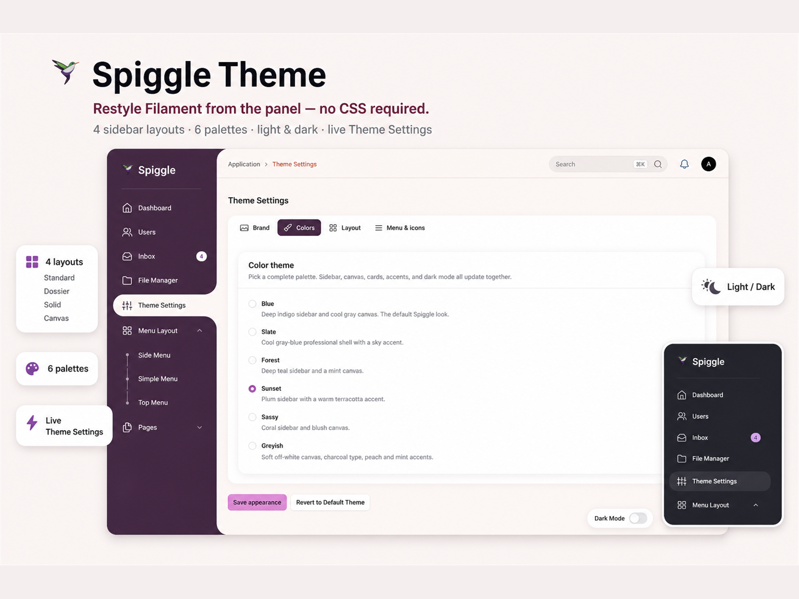

# Spiggle Theme

A Filament PHP admin theme: deep blue sidebar, rounded content card, active-nav cutout, Roboto typography, and a live Theme Settings page.

**Current version:** [2.0.50](https://skillbobby.github.io/spiggle/filament-theme/)



Filament v3, v4, and v5 (v5 is the primary target).

## License

**$9.99** once — unlimited sites. No license-key screen; the paid package is the license.

**[Buy a lifetime copy](https://kodesmart.lemonsqueezy.com/checkout/buy/70dd247d-942c-4768-90e5-98caa0d487cb)**

Product page: [skillbobby.github.io/spiggle/filament-theme](https://skillbobby.github.io/spiggle/filament-theme/)

## Demo

| | |
|---|---|
| **URL** | [skillbobby.com/larafill/public/admin/login](https://skillbobby.com/larafill/public/admin/login) |
| **Email** | `demo@user.net` |
| **Password** | `password` |

Open **Theme Settings** in the sidebar to switch layouts and palettes.

## Features

- Layout: `#1C3FAA` sidebar, `#F1F5F8` content canvas, ~30px content radius, ~20px cards
- Sidebar styles: **Standard** (active item cut into the content card), **Dossier** (stacked file tabs), **Solid** (opaque column flush with the pane), **Canvas** (nested menus; cards sit on the page background)
- Palettes: Blue, Slate, Forest, Sunset, Sassy, Greyish
- Light and dark mode (floating Dark Mode pill + Filament theme store)
- Settings page: brand, palettes, shape, density, backgrounds, fonts, menu size, icon pack
- Translations: English ships with the package; publish strings to customize them or add another locale
- Responsive sidebar with desktop collapse and mobile overlay
- Table rows and View/Edit actions open in a lightbox

## Installation

```bash
composer require spiggle/filament-spiggle-theme
```

The plugin auto-registers on every Filament panel. To register it yourself:

```php
use Spiggle\FilamentSpiggleTheme\FilamentSpiggleThemePlugin;

$panel->plugin(FilamentSpiggleThemePlugin::make());
```

Then set `auto_register` to `false` in the published config.

```bash
php artisan vendor:publish --tag=filament-spiggle-theme-config
```

## Language support

```bash
php artisan vendor:publish --tag=filament-spiggle-theme-translations
```

Files land in `lang/vendor/filament-spiggle-theme/{locale}/theme.php`. Copy `en` into another locale folder and set `APP_LOCALE` (or Filament’s locale).

## Contact

skillbobby@outlook.com
