# Spiggle Material Theme

Public product page and comprehensive showcase for **Spiggle Material Theme**, a Laravel 13 and Filament 5 plugin that restyles the admin panel with Material Design[cite: 1, 2].

Live site: [skillbobby.github.io/spiggle/material-theme](https://skillbobby.github.io/spiggle/material-theme/)[cite: 1]

Package source stays in its own repository. This folder is the public showcase only[cite: 1].

## What it is

Material Design chrome built specifically for Laravel Filament 5, utilizing Roboto typography, 24dp icons, and tonal surfaces[cite: 1, 2]. Tables, forms, and resources remain natively Filament, while the surrounding shell—including the sidebar, top bar, cards, login screen, and notifications—is completely restyled. Everything from your brand logo, primary colors, and density to notification preferences, global search, toolbar shortcuts, and the promo banner can be managed directly inside Theme Settings powered by Spatie Laravel Settings[cite: 1, 2]. No Vite or Tailwind rebuilds are required[cite: 1, 2].

## Core Features & Capabilities

* **Material Design Chrome:** Restyles the sidebar, canvas, and cards using Roboto type, 24dp icons, and tonal surfaces while keeping core Filament controls intact.
* **Theme Settings in the Panel:** Manage your brand, primary color, density, icon pack, promo banner, and dark mode preferences natively using Spatie Laravel Settings.
* **Brand Logo & Title:** Upload custom marks for the sidebar and sign-in screen, and configure your brand title and tagline without touching CSS.
* **Light and Dark Modes:** Includes a top bar scheme switcher or the option to force dark mode and hide the toggle via Theme Settings.
* **Toolbar Shortcuts:** Pin Lucide icons in the top bar that link directly to any panel URL, with editable sets managed from Theme Settings.
* **Lucide Icon Pack:** Optionally swap out standard Filament Heroicons for Lucide icons across navigation and theme chrome.
* **Notifications Inbox:** Features All, System, and Archive tabs, read/delete controls, and automatic Spatie Activity Log integration for system notifications.
* **Global Search:** Search across resource records straight from the top bar with identifier badges showing exactly what you opened.
* **List View:** Companion plugin capability allowing you to toggle any Filament table to an alphabetical A–Z list featuring avatars and stacked columns.
* **Additional Inclusions:** Includes a promo banner with ticker, compact account page, dense spacing options, subdirectory support (leveraging Laravel's asset helpers), and fully mobile-ready layouts.

## Screenshots & Gallery

The public showcase features comprehensive visual previews across desktop and mobile devices:

* **Sign-in Screen 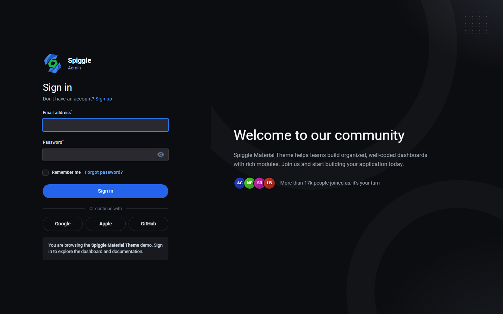:** Material Theme sign-in screen with the custom brand logo and welcome panel.
 
* **Theme Settings 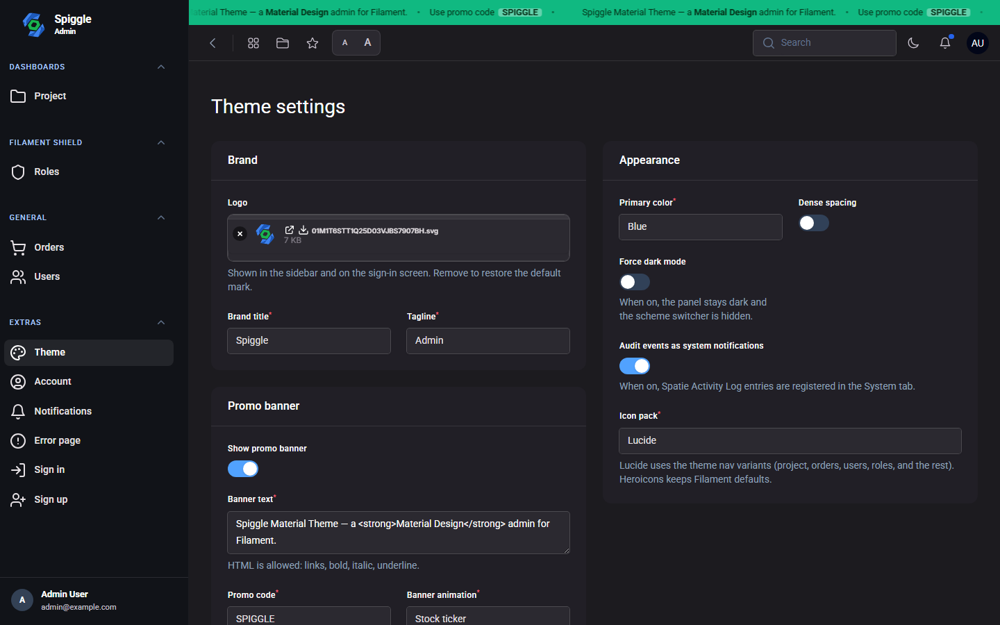:** Configuration panel for brand logo, promo banner, primary color, and Lucide icons.
 
* **Filament Tables 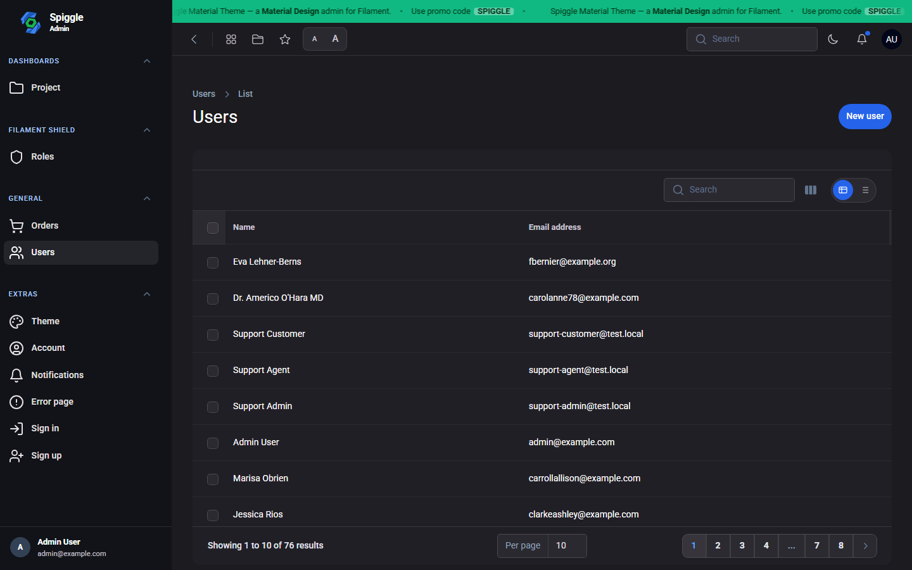:** Users table restyled with Material chrome, search, and pagination.
 
* **List View 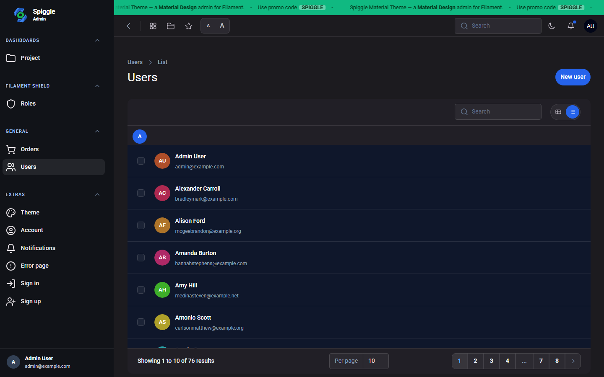:** Users List View featuring A–Z grouping, avatars, and stacked name and email columns.
 
* **Notifications Inbox 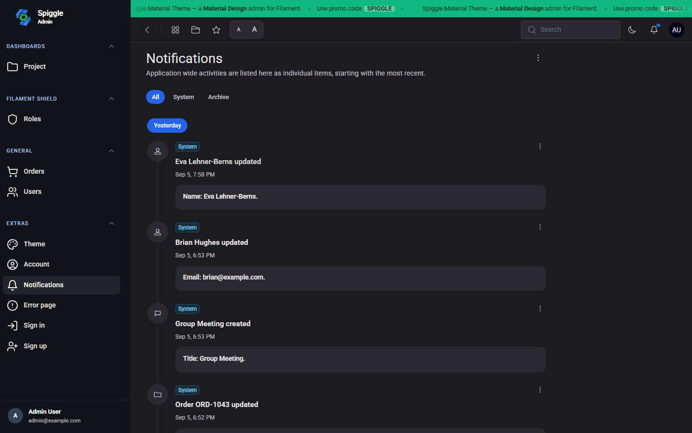:** Dedicated notifications page organized with All, System, and Archive tabs.

* **Notification Controls 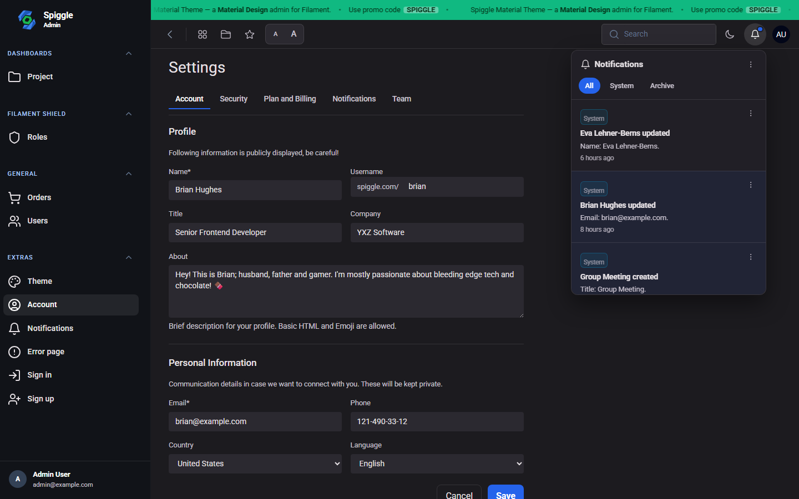:** Dropdown notification panel with mark read, delete, and overflow menu controls.

* **Global Search 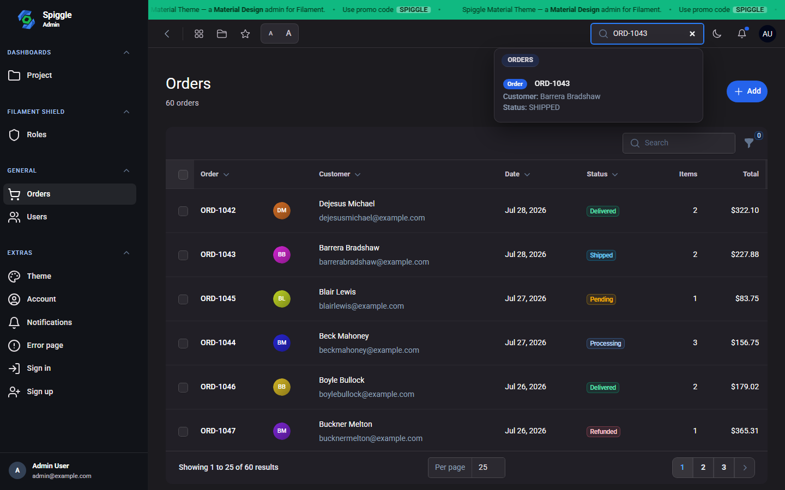:** Global search results displaying identifier badges.

* **Toolbar Shortcuts 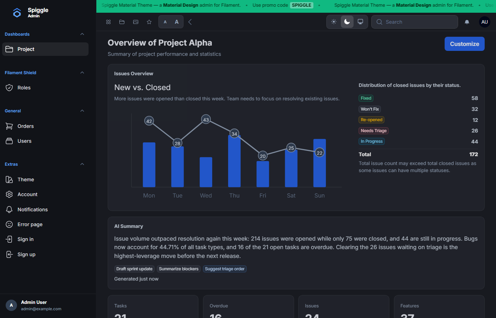:** Quick-access toolbar shortcut icons integrated into the Material top bar.

* **Account Page 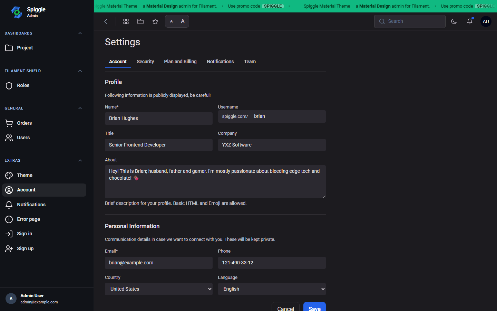:** Compact account management page styled with Material forms.

* **Mobile Views:** 
  * 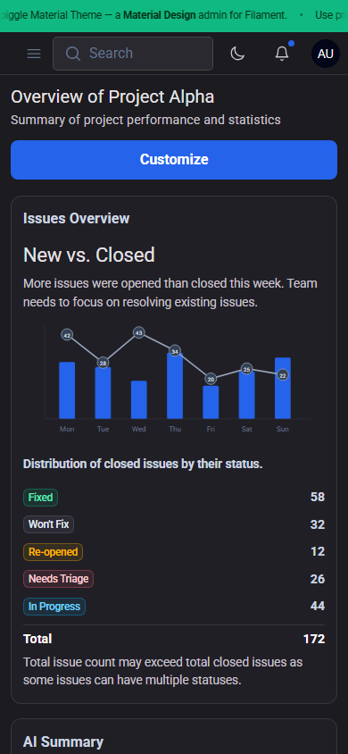 — Optimized dashboard view on a mobile device.
  * 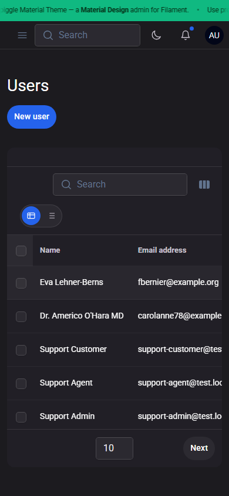 — Responsive users table on a phone.
  * 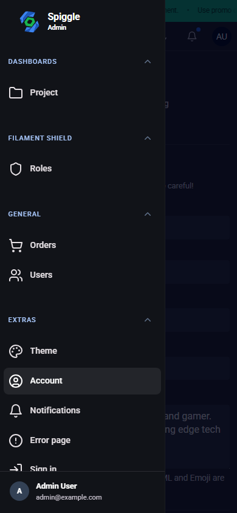 — Material sidebar navigation layout on mobile screens.

## Installation & Workflow

1. **Register the plugin:** Add `MaterialThemePlugin::make()` to your panel provider, configuring optional brand titles, taglines, density, and demo pages.
2. **Open Theme Settings:** Upload your logo, select primary colors, toggle density or dark mode, choose between Lucide or Heroicons, and set your promo banner.
3. **Keep your resources:** Forms and tables remain natively Filament while the entire shell, including login, account pages, and notifications, gets restyled.

## Pricing & Licensing

* **Price:** **$39** lifetime license[cite: 1, 2].
* **Terms:** Pay once for lifetime access to all package files with no seat limits or yearly renewals, allowing you to use it on an unlimited number of Laravel Filament apps[cite: 1, 2].
* **Status:** Checkout links are coming soon; until then, licensing can be arranged by getting in touch via email[cite: 1, 2].

## FAQ Summary

* **Vite / Tailwind Rebuild:** Not required; theme CSS ships directly within the package.
* **System Requirements:** Built primarily for Laravel 13 and Filament 5 on PHP 8.3+.
* **Subdirectory Compatibility:** Fully supported via Laravel's `asset()` helper (e.g., panels running at `/spiggle/admin` load seamlessly).

## Contact

[@iamspiggle](https://x.com/iamspiggle)
